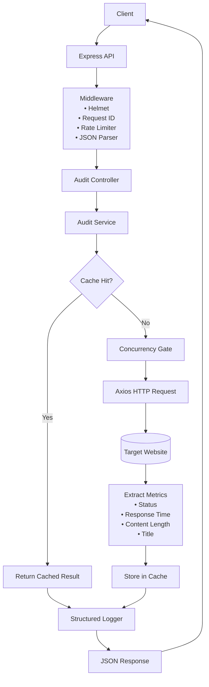
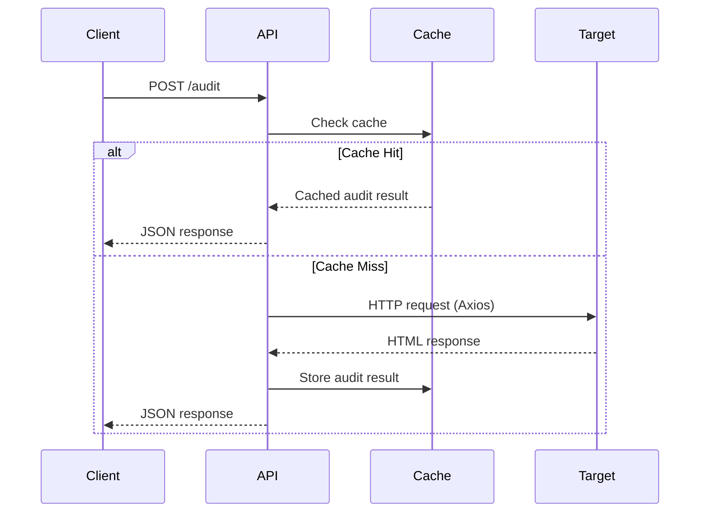
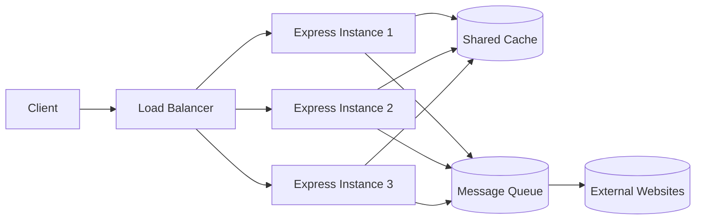

# Architecture Document

## 1. System Overview

Page Pulse is a lightweight production-style URL auditing API. It accepts client requests for webpage audits, validates each target URL, fetches the remote page, and returns audit metrics such as HTTP status code, response time, content length, and page title.

The primary purpose of the service is to provide a resilient, request-driven audit endpoint for external web pages, with built-in validation, caching, concurrency control, rate limiting, and structured logging.

## 2. High-Level Architecture

- **Client**
  - Any HTTP client or frontend that sends requests to the service.
  - Primary interactions are `GET /health` and `POST /audit`.

- **Express API**
  - The application is built on Express.js.
  - The main entry point routes incoming requests to the correct handlers.

- **Middleware pipeline**
  - A sequence of middleware processes each request before it reaches the route handlers.
  - Includes security headers, request ID generation, rate limiting, structured logging, JSON parsing, and error handling.

- **URL Audit Service**
  - The service layer contains the business logic for URL validation, caching, and page fetching.
  - It encapsulates all audit-specific processing and keeps the controller lightweight.

- **External website being audited**
  - The target page is fetched using Axios.
  - The service inspects HTTP status, response time, content length, and page title from the fetched HTML.

- **In-memory cache**
  - A node-cache instance stores successful audit results for a configurable TTL.
  - Cache hits avoid outbound HTTP requests for repeated audits of the same normalized URL.

- **Logging**
  - Structured request logs are emitted for every request.
  - Logs include request ID, method, path, status code, and response time.

- **Rate limiter**
  - `express-rate-limit` controls requests per client IP.
  - Rate limit configuration is environment-driven.

## 3. Data Flow

A `POST /audit` request follows this lifecycle:

1. **Client sends request**
   - The request includes a JSON body with a `url` field.

2. **Express receives the request**
   - The request enters the Express application and travels through the middleware stack.

3. **Middleware pipeline**
   - Security headers are applied.
   - A unique request ID is generated and attached to `req` and the response header `X-Request-ID`.
   - Rate limiting is checked for the client IP.
   - Structured logging setup begins timing the request.
   - JSON body parsing prepares the payload for routes.

4. **Validation**
   - The audit controller forwards the payload to the audit service.
   - The audit service validates that the request body is present and that `url` is a non-empty string.
   - It validates URL syntax and enforces `http` or `https` protocols.

5. **Cache check**
   - The normalized validated URL becomes the cache key.
   - If a cached audit result exists, it is returned immediately without outbound fetch. This significantly reduces latency for repeated requests and lowers outbound network traffic.

6. **Concurrency gate**
   - If the URL is not cached, the service checks the current active audit counter.
   - If the active request count is below the configured maximum, the request proceeds.
   - If the limit is reached, the request fails with an HTTP 429 error.

7. **Axios request**
   - The service performs an outbound Axios request to the target website.
   - The response is captured with timeout handling and redirect limits.

8. **Target website response**
   - The service records the HTTP status code, response time, and response body.
   - It extracts content length from headers or payload size.
   - The HTML title is parsed from the response body.

9. **Response generation**
   - Successful audit metrics are formatted into the existing API response structure.
   - The result is cached for future identical requests.

10. **Logging and response**
    - The middleware logs the completed request with request ID, path, status, and response time.
    - The response is sent back to the client.

## 4. Queueing Strategy

Concurrency limiting is implemented with an in-memory counter that controls the number of active outbound audit requests. This acts as a lightweight gate rather than a full message queue.

For the current workload, an explicit message queue is unnecessary because:

- Audit requests are synchronous and request-driven.
- The application uses caching to reduce repeated outbound requests.
- Concurrency limits already prevent unbounded outbound load.

If throughput increased significantly, a proper queueing layer such as BullMQ or RabbitMQ could be introduced to:

- persist pending audit requests
- decouple request intake from processing
- smooth bursts of traffic
- enable retry and backoff strategies

## 5. State Management

Current application state is minimal and localized:

- **Request lifecycle**
  - Per-request state is stored on the Express `req` object for the duration of the request.
  - This includes the generated request ID and request metadata.

- **In-memory cache**
  - Successful audit results are stored in node-cache.
  - Cache entries expire after the configured TTL.

- **Rate limiting counters**
  - `express-rate-limit` maintains in-memory counters per client IP.
  - This state enforces request quotas and resets over the window.

Aside from these transient stores, the service is otherwise stateless and does not retain persistent user or audit history.

## 6. Architecture Diagram
6.1 High-Level Architecture

6.2 Request Flow (Sequence Diagram)

6.3 Future Scalable Architecture

## 7. Scalability Notes

To support approximately 10,000 audits per day and bursts of 500 concurrent requests, the architecture could evolve in several ways:

- **Horizontal scaling behind a load balancer**
  - Stateless application instances allow multiple Express    servers to process requests concurrently while sharing centralized cache and rate-limiting infrastructure.
  - Run multiple application instances behind a load balancer.
  - Ensure consistent request routing and shared rate limiting state if required.

- **Distributed caching**
  - Replace in-memory cache with a shared cache such as Redis for consistency across instances.

- **External queueing**
  - Add a queue to buffer incoming audit requests and process them at a controlled rate.
  - This would reduce pressure on outbound HTTP requests during bursts.

- **Autoscaling and capacity planning**
  - Scale instances based on concurrency and request volume.
  - Maintain the concurrency gate per instance while coordinating capacity.

- **Monitoring and Future Resilience**
  - Add observability around external website failures and slow responses.
  - Expose health checks, request metrics, and structured logs to a monitoring platform for alerting.
  - Introduce circuit breakers in future deployments to protect the service from repeated downstream failures.

These changes would preserve the current request-driven architecture while improving reliability and burst-handling capability.
