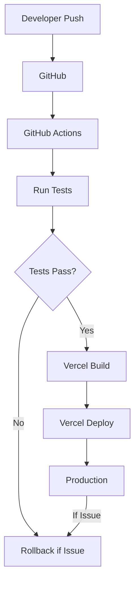

# Observability and Rollback Plan

## 1. Purpose

Observability and rollback planning are essential for production APIs because they enable teams to quickly detect when something is wrong, understand what happened, and recover gracefully. Strong observability helps diagnose root causes faster, while a documented rollback procedure reduces downtime and risk during deployments.

---

## 2. Current Observability

The Page Pulse API already includes several observability features that support production-style operations:

- **Structured request logging** - Every request generates a JSON log with request ID, HTTP method, path, status code, and response time.
- **Request IDs** - A unique UUID is generated for every request and included in response headers (`X-Request-ID`), enabling request tracing through logs.
- **Health endpoint** - The `/health` endpoint returns the application status and uptime, enabling simple availability monitoring.
- **Standardized error responses** - All errors follow the same `{ success: false, error: { message: "..." } }` structure, making error parsing consistent.
- **Rate limiting** - Request counts per IP are tracked, helping identify abusive traffic patterns.
- **Concurrency limiting** - Active audit counts are tracked, providing visibility into outbound request pressure.

These features enable rapid diagnosis of issues such as error surges, latency increases, traffic spikes, or external service failures.

---

## 3. Metrics to Monitor

| Metric | Why it Matters | Alert Threshold |
|--------|---|---|
| Request count | Detect traffic anomalies and growth patterns | Spike > 50% above 1-hour baseline |
| Error rate | Identify application or external failures | > 5% of requests returning error |
| Average response time | Detect performance degradation | > 2 seconds |
| 95th percentile latency | Identify tail latencies affecting user experience | > 5 seconds |
| Cache hit rate | Track caching efficiency | < 40% hit rate for repeated URLs |
| Cache miss rate | Detect cache effectiveness issues | > 60% miss rate |
| Active concurrent audits | Identify concurrency limit saturation | > 8 of 10 active limit |
| Rate-limit violations | Detect abuse or misconfigured clients | > 10 violations per minute |
| Memory usage | Prevent memory exhaustion | > 80% of available heap |
| CPU utilization | Detect compute bottlenecks | > 80% sustained usage |

---

## 4. Logging Strategy

The application uses structured JSON logging to capture each request:

```json
{
  "requestId": "90ab5051-6e48-4691-aa32-2ea49af25f45",
  "method": "POST",
  "path": "/audit",
  "status": 200,
  "responseTimeMs": 1366
}
```

Each log entry includes:

- `requestId` - The unique request identifier for tracing
- `method` - The HTTP verb
- `path` - The request path or route
- `status` - The HTTP status code
- `responseTimeMs` - The total request duration in milliseconds

Structured logs simplify troubleshooting because they are machine-parseable, consistent, and include enough context to correlate related requests and understand request flow through the system.

---

## 5. Alerting Strategy

### Alert: High Error Rate

**Trigger:** Error rate > 5% for 5 minutes

**Operational impact:** Clients are unable to complete audits successfully

**Recommended response:** 
- Check `/health` endpoint status
- Review structured logs for error patterns
- Check for external website outages
- Verify rate limit settings if spike detected

### Alert: Slow Response Times

**Trigger:** 95th percentile latency > 5 seconds for 5 minutes

**Operational impact:** Users experience high latency; audit requests may timeout

**Recommended response:**
- Check external website performance
- Review active concurrency count
- Verify cache hit rate
- Check CPU and memory usage

### Alert: Excessive Rate-Limit Events

**Trigger:** Rate-limit violations > 10 per minute

**Operational impact:** Legitimate clients may be blocked; abuse is occurring

**Recommended response:**
- Identify the source IP from logs
- Check if it is legitimate traffic or abuse
- Consider adjusting rate limits or adding IP whitelist

### Alert: High Memory Usage

**Trigger:** Memory usage > 80% of available heap for 2 minutes

**Operational impact:** Application may crash or become unstable

**Recommended response:**
- Check cache size and TTL settings
- Review cache hit rates
- Consider reducing `CACHE_TTL_SECONDS`
- Plan for horizontal scaling

### Alert: Service Unavailable

**Trigger:** `/health` endpoint returns non-200 status or times out

**Operational impact:** Service is degraded or down

**Recommended response:**
- Immediate investigation of application logs
- Restart the service if needed
- Trigger rollback if recent deployment
- Escalate to infrastructure team

---

## 6. Deployment Strategy



The current deployment process:

1. **Developer push** - Changes are pushed to the main branch on GitHub
2. **GitHub Actions CI** - Automated tests run immediately
3. **Test verification** - If tests fail, deployment stops and the developer is notified
4. **Vercel build** - If tests pass, Vercel builds the application
5. **Vercel deployment** - Vercel deploys the new build to production with zero downtime
6. **Production live** - The new version is live and serving traffic

Every code change is automatically validated by the GitHub Actions workflow before deployment, ensuring the application passes the automated test suite prior to release.

---

## 7. Rollback Plan

If a deployment introduces production issues:

### Step 1: Detect Issue
- Monitor `/health` endpoint and error rates
- Alert team to anomaly

### Step 2: Verify Deployment Caused Issue
- Check deployment timestamp
- Compare error rate before and after deployment
- Review recent code changes

### Step 3: Initiate Rollback
- Access Vercel dashboard
- Navigate to deployment history
- Select the last known good deployment
- Promote to production (Vercel provides one-click rollback)

### Step 4: Confirm Health
- Test `/health` endpoint
- Verify it returns `{ success: true, data: { status: "ok" } }`
- Check error rate is returning to baseline

### Step 5: Smoke Test Audit Endpoint
- Run a test audit request against `/audit`
- Verify successful response with expected fields
- Check response times are reasonable

### Step 6: Investigate Root Cause
- Review code changes in the problematic deployment
- Run tests locally with the problematic code
- Identify the bug
- Fix the issue
- Test locally before redeployment

---

## 8. Future Improvements

As the service grows, consider these enhancements for enterprise-grade observability:

- **Prometheus metrics** - Export structured metrics for aggregation and analysis
- **Grafana dashboards** - Visualize trends in request volume, error rate, latency, and resource usage
- **Centralized log aggregation** - Collect logs from multiple instances in a centralized store (e.g., ELK stack)
- **Distributed tracing** - Use OpenTelemetry to trace requests across service boundaries
- **Redis monitoring** - If Redis is adopted for caching or rate limiting, monitor cache performance and memory
- **Automated alert escalation** - Escalate unresolved alerts to on-call teams automatically

These tools would enable deeper visibility and faster incident response for a scaled deployment.

---

## 9. Conclusion

The current implementation already supports production-style observability through structured logging, request IDs, a health endpoint, rate limiting, standardized error handling, and concurrency tracking. These capabilities enable teams to detect anomalies, trace requests, and diagnose issues effectively. The rollback plan provides a clear path to recover from problematic deployments with minimal disruption. As the service scales, the outlined future improvements in metrics collection, visualization, and centralized monitoring would extend operational resilience and enable more proactive incident response.
